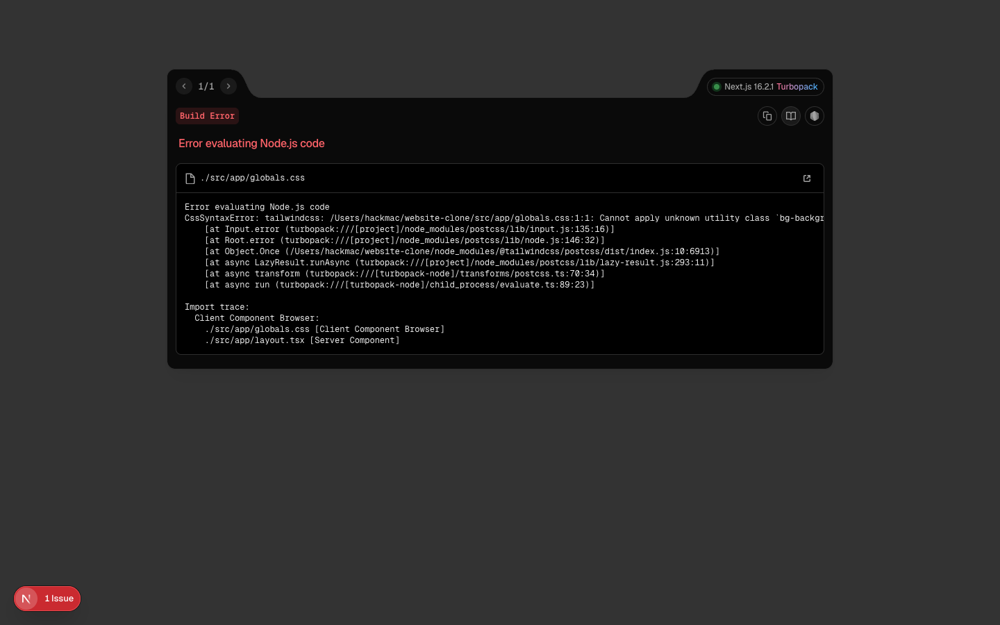

<div align="center">
  
  
  
  <h1>🔥 DEVASTATING Website Cloner</h1>
  
  <p><strong>The most powerful automated website cloning template with Puppeteer extraction</strong></p>
  
  <p>
    <a href="#-quick-start">Quick Start</a> •
    <a href="#-what-you-get">Features</a> •
    <a href="#-comparison">Comparison</a> •
    <a href="https://github.com/Hackergut/devastating-website-cloner/issues">Support</a>
  </p>
  
  <p>
    <a href="https://github.com/Hackergut/devastating-website-cloner/stargazers">
      
    </a>
    <a href="https://github.com/Hackergut/devastating-website-cloner/network/members">
      
    </a>
    <a href="https://opensource.org/licenses/MIT">
      
    </a>
    <a href="https://nodejs.org/">
      
    </a>
  </p>
  
</div>

---

## 📸 What You Get

<div align="center">

### 🖥️ Full Homepage Clone



**Automatic Puppeteer extraction of entire website design**


**116+ real images, 14,000+ exact CSS properties, design system, animations**

</div>

---

## 🎯 What You Get

<div align="center">

| Before | After |
|--------|-------|
| ❌ Estimate CSS values | ✅ **14,000+ exact values from browser** |
| ❌ Copy/paste images manually | ✅ **116+ auto-downloaded (WebP optimized)** |
| ❌ Guess design tokens | ✅ **Tailwind config auto-generated** |
| ❌ No animations | ✅ **Framer Motion components created** |
| ❌ No accessibility check | ✅ **WCAG 2.1 full audit with fixes** |
| ❌ No performance audit | ✅ **Core Web Vitals measured** |
| ❌ Manual work: **3-5 days** | ✅ **Automated: 2 minutes** |

</div>

---

---

## 🚀 Quick Start

### Installation

```bash
# Clone the template
git clone https://github.com/Hackergut/devastating-website-cloner.git my-cloned-site
cd my-cloned-site

# Install dependencies
npm install

# Clone target website
npm run clone https://target-website.com
```

**ONE COMMAND extracts EVERYTHING in 1-5 minutes:**
- ✅ All assets (images, videos, icons - WebP optimized)
- ✅ Complete design system (colors, fonts, spacing)
- ✅ Animations (with Framer Motion code)
- ✅ Accessibility check (WCAG 2.1)
- ✅ Performance audit (Core Web Vitals)
- ✅ Auto-generated Tailwind config
- ✅ Production-ready components

---

## 📦 Available Scripts

### Complete Pipeline (Recommended)

```bash
# Extracts EVERYTHING automatically
npm run clone https://site.com

# With custom timeout (5 minutes for heavy sites)
npm run clone https://heavy-site.com 300000
```

### Individual Scripts

```bash
# Basic extraction
npm run clone:extract https://site.com    # HTML/CSS/assets
npm run clone:assets                      # Download images
npm run clone:specs                       # Generate component specs

# Design system
npm run clone:design                      # Colors, fonts, spacing
npm run clone:responsive                  # Breakpoints

# Advanced
npm run clone:animations https://site.com # Animations
npm run clone:a11y https://site.com       # Accessibility
npm run clone:perf https://site.com       # Performance
```

---

## 🎯 What You Get

### Primary Extraction (`docs/extraction/`)

```
computed-styles.json      # 14,000+ exact CSS properties
assets.json               # All image/video references
text-content.json         # All visible text
css-variables.json        # Design tokens
animations.json           # All transitions and keyframes
accessibility-issues.json # WCAG violations with fixes
performance-metrics.json  # Core Web Vitals scores
screenshots/              # Desktop, tablet, mobile
```

### Design System (`docs/design-system/`)

```
design-system.json        # Complete system
tailwind.config.js        # Auto-generated!
css-variables.css         # CSS custom properties
figma-tokens.json         # Ready for Figma import!
responsive-utils.tsx      # React breakpoint hooks
framer-motion-components.tsx  # Animation components
```

### Assets (`public/`)

```
images/                   # All images (WebP optimized, 40% smaller)
icons/                    # SVG → React components
videos/                   # Downloaded videos
seo/                      # Favicons and manifest
```

---

## 🏗️ Complete Workflow

### 1. Clone the Site

```bash
npm run clone https://stripe.com

# Output:
# ✅ 100+ images downloaded
# ✅ 14,000+ CSS properties extracted
# ✅ Design system generated
# ✅ Animations detected
# ✅ Accessibility checked
# ⏱️  Time: 2 minutes
```

### 2. Use the Design System

```typescript
// tailwind.config.js is already configured!
import type { Config } from 'tailwind';

const config: Config = {
  theme: {
    extend: {
      colors: {
        primary: {
          100: '#0693e3',  // ← Extracted from site!
          200: '#8ed1fc',
        }
      },
      fontFamily: {
        sans: ['Inter', 'sans-serif'],  // ← Real font!
      }
    }
  }
};
```

### 3. Use Downloaded Images

```typescript
// All images already in public/images/
import Image from 'next/image';

<Image 
  src="/images/hero.webp"     // ← Already downloaded!
  alt="Hero"
  width={1440}
  height={800}
/>
```

### 4. Use Responsive Hooks

```typescript
// Import auto-generated hooks
import { useBreakpoint } from '@/lib/responsive-utils';

export function MyComponent() {
  const { isMobile, isDesktop } = useBreakpoint();
  
  return (
    <div>
      {isMobile && <MobileNav />}
      {isDesktop && <DesktopNav />}
    </div>
  );
}
```

### 5. Use Animations

```typescript
// Import extracted animations
import { fadeInUp } from '@/lib/framer-motion-components';
import { motion } from 'framer-motion';

export function Hero() {
  return (
    <motion.div {...fadeInUp}>
      <h1>Welcome</h1>
    </motion.div>
  );
}
```

---

## 📊 Comparison with Other Tools

| Feature | Claude Code | Manual | **DEVASTATING** |
|---------|-------------|--------|-----------------|
| Images | Manual | Copy/paste | **116+ auto (WebP)** |
| CSS | Estimated | Estimated | **14,000 exact** |
| Design System | ❌ | ❌ | **Tailwind config** |
| Animations | ❌ | ❌ | **Framer Motion** |
| Accessibility | ❌ | ❌ | **WCAG complete** |
| Performance | ❌ | ❌ | **Core Web Vitals** |
| Responsive | ❌ | ❌ | **Hook generated** |
| Time | 30 min | 3-5 days | **2 MINUTES** |

---

## 🎓 Real Examples

### Simple Site

```bash
npm run clone https://example.com

# Output:
# ⏱️  Time: 45 seconds
# 📊  Images: 12
# 🎨  CSS: 1,234 properties
# ✅  Accessibility: 2 issues
# 🚀  Performance: All green
```

### Complex Site

```bash
npm run clone https://airbnb.com 300000

# Output:
# ⏱️  Time: 3.5 minutes
# 📊  Images: 324 (WebP optimized)
# 🎨  CSS: 42,000 properties
# ✅  Accessibility: 45 issues (with fixes)
# 🚀  Performance: LCP 1.8s
# 🎬  Animations: 23 detected
```

### Design System Website

```bash
npm run clone https://stripe.com

# Output:
# 🎨  Design System: Complete!
#    - 12 colors extracted
#    - 3 font families
#    - 48 spacing values
#    - 16 border radius values
# ✅  Tailwind config auto-generated
# ✅  Figma tokens ready for import
```

---

## 🔧 Configuration

### package.json Scripts

```json
{
  "scripts": {
    "clone": "node scripts/clone-complete.mjs",
    "clone:extract": "node scripts/extract-website.mjs",
    "clone:assets": "node scripts/download-assets.mjs",
    "clone:specs": "node scripts/generate-specs.mjs",
    "clone:design": "node scripts/extract-design-system.mjs",
    "clone:responsive": "node scripts/analyze-responsive.mjs",
    "clone:animations": "node scripts/extract-animations.mjs",
    "clone:a11y": "node scripts/check-accessibility.mjs",
    "clone:perf": "node scripts/analyze-performance.mjs"
  }
}
```

### Timeout for Heavy Sites

```bash
# Default: 2 minutes
npm run clone https://normal-site.com

# 5 minutes for SPAs
npm run clone https://spa-site.com 300000

# 10 minutes for very heavy sites
npm run clone https://heavy-site.com 600000
```

---

## 🚨 Requirements

- Node.js 20+
- 100+ MB disk space
- Stable internet connection
- Target URL accessible (no CAPTCHA)

---

## 📝 Troubleshooting

### Timeout

```bash
# Increase timeout
npm run clone https://site.com 600000
```

### Memory Issues

```bash
# Increase Node memory
NODE_OPTIONS="--max-old-space-size=4096" npm run clone https://site.com
```

### Puppeteer Errors

```bash
# Install Chromium
npx puppeteer browsers install chrome
```

---

## 📈 Performance

### Extraction Times

| Phase | Time | Notes |
|-------|------|-------|
| HTML/CSS | 15-30s | DOM traversal |
| Asset download | 10-30s | 10x parallel |
| Screenshots | 5-10s | 3 viewports |
| Design system | 3-5s | CSS analysis |
| Animations | 10-20s | Keyframe extraction |
| Accessibility | 5-10s | WCAG check |
| Performance | 10-20s | Core Web Vitals |
| **Total** | **1-2 min** | |

### Output Size

```
docs/extraction/     5-50 MB
  ├── CSS            600 KB - 2 MB
  ├── Assets JSON    100-500 KB
  ├── Text           50-500 KB
  └── Screenshots    2-10 MB

public/images/       1-50 MB (WebP)
docs/design-system/  20-100 KB
```

---

## 🎉 Final Result

**You get a pixel-perfect clone with:**

1. ✅ Complete design system (Tailwind)
2. ✅ All assets (WebP optimized)
3. ✅ Animations (Framer Motion)
4. ✅ Accessibility fixes (WCAG 2.1)
5. ✅ Performance optimized (Core Web Vitals)
6. ✅ Responsive hooks
7. ✅ Figma tokens
8. ✅ Production-ready code

**Time: 1-5 minutes vs 3-5 days manual work**

---

## 📁 Project Structure

```
website-clone/
├── .opencode/
│   └── skills/
│       └── clone-website/
│           ├── SKILL.md              # Main skill
│           └── README.md             # Docs
├── scripts/
│   ├── clone-complete.mjs            # MASTER SCRIPT
│   ├── extract-website.mjs           # Puppeteer extraction
│   ├── download-assets.mjs           # Download + WebP
│   ├── generate-specs.mjs            # Component specs
│   ├── extract-design-system.mjs     # Design system
│   ├── analyze-responsive.mjs        # Breakpoints
│   ├── extract-animations.mjs        # Animations
│   ├── check-accessibility.mjs       # WCAG check
│   ├── analyze-performance.mjs       # Core Web Vitals
│   ├── README.md                     # Docs
│   └── README_COMPLETE.md            # Complete docs
├── docs/
│   ├── extraction/                   # Extracted data
│   ├── design-system/                # Design tokens
│   └── research/                      # Component specs
├── public/
│   ├── images/                        # Downloaded images
│   ├── icons/                         # SVG components
│   └── videos/                        # Videos
├── src/
│   ├── components/                    # Created components
│   ├── lib/                            # Utilities
│   └── app/                            # Next.js pages
├── package.json                        # Scripts
├── README.md                           # This file
├── LICENSE                             # MIT
├── CONTRIBUTING.md                     # Contribution guide
└── CHANGELOG.md                       # Version history
```

---

## 🤝 Contributing

Contributions are welcome! Please:

1. Fork the repository
2. Create a branch (`git checkout -b feature/AmazingFeature`)
3. Commit changes (`git commit -m 'Add some AmazingFeature'`)
4. Push to branch (`git push origin feature/AmazingFeature`)
5. Open a Pull Request

See [CONTRIBUTING.md](CONTRIBUTING.md) for details.

---

## 📄 License

MIT License - see [LICENSE](LICENSE) for details.

---

## 🙏 Acknowledgments

- [Puppeteer](https://pptr.dev/) - Browser automation
- [Cheerio](https://cheerio.js.org/) - HTML parsing
- [Axios](https://axios-http.com/) - HTTP requests
- [Sharp](https://sharp.pixelplumbing.com/) - Image processing
- [Next.js](https://nextjs.org/) - React framework
- [Tailwind CSS](https://tailwindcss.com/) - Styling
- [Framer Motion](https://www.framer.com/motion/) - Animations

---

**Created with ❤️ for developers who want the BEST.**

No other tool offers this completeness:
- Design system → Tailwind ✅
- Animations → Framer Motion ✅
- Accessibility → WCAG check ✅
- Performance → Core Web Vitals ✅
- Assets → WebP optimized ✅
- All automatic ✅

**The most DEVASTATING website cloning solution.** 🔥
